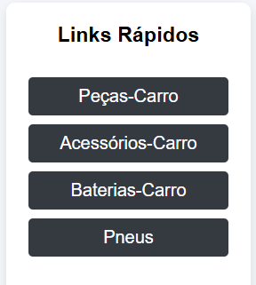
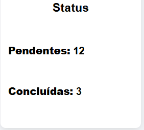

# Sistema de Controle de Tarefas
## Projeto Integrador Desenvolvimento de Sistemas

Aplicação web desenvolvida com o objetivo de auxiliar na organização e gerenciamento de tarefas administrativas em uma oficina mecânica.

O sistema permite cadastrar, visualizar, concluir e excluir tarefas, proporcionando maior controle sobre as atividades diárias e contribuindo para a melhoria do fluxo de trabalho.

##  Preview do Sistema

#### Tela Principal

#### Botões Extras

#### Status das Tarefas


## Funcionalidades

- Cadastro de novas tarefas
- Listagem de tarefas cadastradas
- Marcação de tarefas como concluídas
- Exclusão de tarefas
- Contador dinâmico de tarefas
- Botões auxiliares para acesso rápido a sites utilizados na rotina administrativa
- Interface responsiva (Desktop, Tablet e Smartphone)

## Tecnologias Utilizadas

- **Python**
- **Flask**
- **SQLite**
- **HTML5**
- **CSS3**
- **Jinja2**

## O projeto segue o padrão cliente-servidor:

- **Backend:** Flask (responsável pelo processamento das requisições e comunicação com o banco de dados)
- **Banco de Dados:** SQLite
- **Frontend:** HTML + CSS + Jinja2

## Estrutura do Projeto

- /projeto
- app.py
- database.db
- /templates
- index.html
- /static
- style.css

## ⚙️ Como Executar o Projeto

1. Clone o repositório:
```
git clone https://github.com/seuusuario/seurepositorio.git
```

2. Acesse a pasta do projeto:

```
cd sistema-de-controle-de-tarefas_oficina
```

3. Crie um ambiente virtual:
```
python -m venv venv
```
4. Ative o ambiente virtual:

🔹 No Windows:
```
venv\Scripts\activate
```
🔹 No Mac/Linux:
```
source venv/bin/activate
```
5. Instale as dependências necessárias para execução da aplicação::

```
pip install flask
```

6. Execute a aplicação:

```
python app.py
```

7. Acesse no navegador:
```
http://127.0.0.1:5000
```

## 🎯 Objetivo do Projeto

Este sistema foi desenvolvido como Projeto Integrador do curso de Análise e Desenvolvimento de Sistemas, com foco na aplicação prática de conceitos como:

- Levantamento de requisitos
- Modelagem UML
- Arquitetura de software
- Banco de dados
- Desenvolvimento Web

---

## Melhorias Futuras

- Implementação de autenticação de usuários
- Filtro e pesquisa de tarefas
- Implementação de API REST
- Deploy em ambiente de produção

---

## 👨‍💻 Autor

Victor Pinheiro de Souza  
Projeto acadêmico – 2026

---


## License

[MIT](https://choosealicense.com/licenses/mit/)